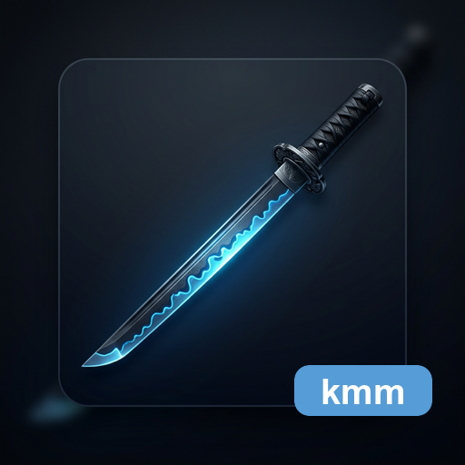

<p align="center">
  
</p>

<h1 align="center">katana-markdown-model</h1>

<p align="center">
  A renderer-neutral Markdown document model library for sharing document structure, external metadata, and source-position resolution across the KatanA ecosystem.
</p>

<p align="center">
  <a href="LICENSE"></a>
  <a href="https://github.com/HiroyukiFuruno/katana-markdown-model/actions/workflows/test-and-build.yml"></a>
  <a href="https://github.com/HiroyukiFuruno/katana-markdown-model/releases/latest"></a>
  <a href="https://crates.io/crates/katana-markdown-model"></a>
</p>

`katana-markdown-model` (KMM) owns the shared Markdown document model, external metadata contract, and source-position resolution used by the KatanA ecosystem.

KMM is not an HTML converter. It provides the common interpretation layer used by KatanA viewers, editors, and export flows.

KMM is the P1 separation target and assumes the shared P0 quality gate provided by `katana-ast-lint`.

## Initial Policy

- KMM v0 prioritizes current KatanA-compatible behavior over full CommonMark coverage.
- The primary fixture input is `/Users/hiroyuki_furuno/works/private/katana/assets/fixtures/sample.md`.
- README badges, alerts, and description lists are required fixture inputs.
- Metadata stays in external files and is not embedded into Markdown content.
- KMM must not depend on KCF, KDV, KatanA, or editor implementations.
- KMM must use the shared AST lint gate instead of repository-local temporary lint rules.

## Development Entry Point

```bash
just check
```

`just check` runs formatting checks, Clippy, KAL AST lint, tests, and OpenSpec validation.

## Minimal Usage

```rust
use katana_markdown_model::{KatanaMarkdownModel, MarkdownInput};

let document = KatanaMarkdownModel::parse(MarkdownInput::from_content(
    "README.md",
    "# Title\n\nBody\n",
))?;
assert_eq!(document.nodes.len(), 2);
# Ok::<(), katana_markdown_model::KmmError>(())
```

## Current Initial Scope

- Renderer-neutral `KmmDocument`, `KmmNode`, and `KmmNodeKind`
- Source ranges, line-column positions, raw snippets, and text fingerprints
- Headings, paragraphs, inline spans, links, images, footnotes, math blocks, HTML blocks, badge rows, lists, code blocks, diagram blocks, tables, blockquotes, alerts, and description lists
- External metadata targets and target re-resolution APIs
- Repository AST lint through `katana-ast-lint`
