# 🧪 KatanA 描画リグレッションテスト

このドキュメントは、KatanA のすべての描画機能を検証するための包括的なサンプルです。
KatanA のプレビューペインで開き、すべての要素が正しく表示されることを目視確認してください。

<p align="center">
  <a href="sample.md">English</a> | 日本語
</p>

---

## 1. HTMLセンタリング（過去不具合: 中央寄せにならず左寄せになる問題）

### 1.1 `<h1 align="center">` — 中央寄せ見出し

<h1 align="center">KatanA Desktop</h1>

↑ 見出し「KatanA Desktop」がパネルの **水平中央** に表示されていること。

### 1.2 `<p align="center">` — 中央寄せ段落

<p align="center">
  高速・軽量な macOS 向け Markdown ワークスペース — Rust と egui で構築。
</p>

↑ 説明文がパネルの **水平中央** に表示されていること。

### 1.3 複数のセンタリングブロックが連続する場合

<h1 align="center">中央寄せ見出し</h1>

<p align="center">
  中央寄せの説明段落。
</p>

<p align="center">
  2つ目の中央寄せ段落 — 1つ目と重ならないこと。
</p>

↑ 3つの要素がそれぞれ独立した行に、すべて中央揃えで表示されること。

### 1.4 バッジ行（複数リンク画像の同一行表示）

<p align="center">
  <a href="#"></a>
  <a href="#"></a>
  <a href="#"></a>
</p>

↑ 3つのバッジが **同一行** に中央揃えで並んでいること。
（個別の行に分かれていたらバグ）

### 1.5 テキスト + リンクの混在センタリング

<p align="center">
  <a href="sample.md">English</a> | 日本語
</p>

↑ 「English | 日本語」が中央揃えの同一行に表示されること。

### 1.6 READMEヘッダー完全再現

<p align="center">
   width=%22128%22 height=%22128%22%3E%3Crect width=%22128%22 height=%22128%22 fill=%22%23ddd%22/%3E%3Ctext x=%2264%22 y=%2264%22 text-anchor=%22middle%22 dominant-baseline=%22central%22 font-size=%2216%22 fill=%22%23999%22%3E128x128%3C/text%3E%3C/svg%3E" width="128" alt="アイコン">
</p>

<h1 align="center">KatanA Desktop</h1>

<p align="center">
  高速・軽量な macOS 向け Markdown ワークスペース
</p>

<p align="center">
  <a href="#"></a>
  <a href="#"></a>
</p>

<p align="center">
  <a href="sample.md">English</a> | 日本語
</p>

↑ アイコン→見出し→説明→バッジ群→言語切替 がすべて中央揃えで順番に表示されること。

---

## 2. Markdown 基本要素

### 2.1 見出しレベル

# H1 見出し

## H2 見出し

### H3 見出し

#### H4 見出し

##### H5 見出し

###### H6 見出し

### 2.2 テキスト装飾

- **太字テキスト**
- *イタリックテキスト*
- ~~取り消し線~~
- <u>下線</u>
- `インラインコード`
- <mark>ハイライト</mark>
- **太字と*イタリック*の混在**

### 2.3 リンク

- [通常のリンク](https://github.com)
- [メールリンク](mailto:test@example.com)
- 自動リンク: <https://github.com>

### 2.4 水平線

上のテキスト

---

下のテキスト

---

## 3. リスト

### 3.1 番号なしリスト

- 項目 1
- 項目 2
  - ネストされた項目 2-1
  - ネストされた項目 2-2
    - さらにネスト 2-2-1
- 項目 3

### 3.2 番号付きリスト

1. 最初の項目
2. 次の項目
   1. ネストされた番号 2-1
   2. ネストされた番号 2-2
3. 最後の項目

### 3.3 タスクリスト

- [x] 完了タスク
- [ ] 未完了タスク
- [-] もう一つの完了タスク
  - [/] ネストされた未完了タスク
  - [x] ネストされた完了タスク

---

## 4. コードブロック

### 4.1 基本的なコードブロック

```rust
fn main() {
    println!("Hello, KatanA!");
}
```

### 4.2 言語指定なしのコードブロック

```text
これは言語指定なしのコードブロックです。
シンタックスハイライトは適用されません。
```

### 4.3 複数言語のシンタックスハイライト

```python
def hello():
    print("Hello from Python")
```

```javascript
function hello() {
    console.log("Hello from JavaScript");
}
```

```json
{
  "name": "katana",
  "version": "0.0.2",
  "features": ["markdown", "diagrams"]
}
```

```yaml
name: KatanA
version: 0.0.2
features:
  - markdown
  - diagrams
```

### 4.4 リスト内のコードブロック（過去不具合: 正しくレンダリングされない）

1. 最初のステップ:

   ```sh
   cargo build --release
   ```

2. 次のステップ:

   ```sh
   ./target/release/KatanA
   ```

3. 確認:
   - サブ項目 A
   - サブ項目 B

↑ リスト項目の中にコードブロックが正しくインデントされて表示されること。

### 4.5 ネストされたリスト内のコードブロック

- 外側の項目
  - 内側の項目

    ```rust
    let x = 42;
    println!("{}", x);
    ```

  - 続きの項目

↑ ネストされたリスト内でもコードブロックが崩れないこと。

---

## 5. テーブル（GFM）

### 5.1 基本テーブル

| 機能 | 状態 | 備考 |
| --- | --- | --- |
| Markdown | ✅ | 完全対応 |
| Mermaid | ✅ | mmdc 必要 |
| PlantUML | ✅ | jar 必要 |
| DrawIo | ✅ | 純Rust |

### 5.2 アライメント付きテーブル

| 左寄せ | 中央寄せ | 右寄せ |
| :--- | :---: | ---: |
| テキスト | テキスト | テキスト |
| 長いテキスト | 短い | 12345 |

### 5.3 1行テーブル

| ヘッダー |
| --- |
| 内容 |

### 5.4 1カラムで折り返しが発生するような長カラム

| ヘッダー |
| --- |
| このテキストは非常に長い行で、水平スクロールやワードラップが正しく動作するかを確認するためのものです。ABCDEFGHIJKLMNOPQRSTUVWXYZabcdefghijklmnopqrstuvwxyz0123456789 を何度も繰り返します。ABCDEFGHIJKLMNOPQRSTUVWXYZabcdefghijklmnopqrstuvwxyz0123456789 |

### 5.5 短カラム+長カラム＋短カラム

| 短い | 長いカラムのテスト | 短い |
| --- | --- | --- |
| ID | このテキストは非常に長い行で、水平スクロールやワードラップが正しく動作するかを確認するためのものです。ABCDEFGHIJKLMNOPQRSTUVWXYZabcdefghijklmnopqrstuvwxyz0123456789 を何度も繰り返します。ABCDEFGHIJKLMNOPQRSTUVWXYZabcdefghijklmnopqrstuvwxyz0123456789 | 備考 |

---

## 6. 引用

### 6.1 基本引用

> これは引用ブロックです。
> 複数行にまたがることができます。

### 6.2 ネストされた引用

> 外側の引用
> > 内側の引用
> > > さらに内側

### 6.3 引用内の装飾

> **太字の引用**
>
> - リスト項目 1
> - リスト項目 2
>
> ```rust
> let quoted_code = true;
> ```

---

## 7. Note ブロック

### 7.1 Note

> **Note**
> GitHub では note 系ブロックを blockquote として表現する。

### 7.2 Tip

> **Tip**
> 短い補足は、読みやすい 2 行程度にまとめると確認しやすい。

### 7.3 Important

> **Important**
> 強調したい注意は、見出し2 配下で独立した blockquote にする。

### 7.4 Warning

> **Warning**
> 危険な操作や壊れやすい表現は、引用ブロックで明示する。

### 7.5 Caution

> **Caution**
> 読者に作業前提を意識させたい場合に使う。

---

## 8. アコーディオン

<details><summary>詳細を見る</summary><div>

- 刀
  - 孫六兼元
  - 菊一文字則宗
  - 備前長船長義

</div></details>

## 9. 数式

### 9.1 ブロック数式

```math
f(x) = \int_{0}^{x} \frac{t^2}{1 + t^4} \, dt
```

### 9.2 インライン数式

質量とエネルギーの等価原理: $ E = mc^2 $

### 9.3 1行数式

$$ \sum_{k=1}^{n} k = \frac{n(n+1)}{2} $$

---

## 10. ダイアグラム — Mermaid

### 10.1 フローチャート

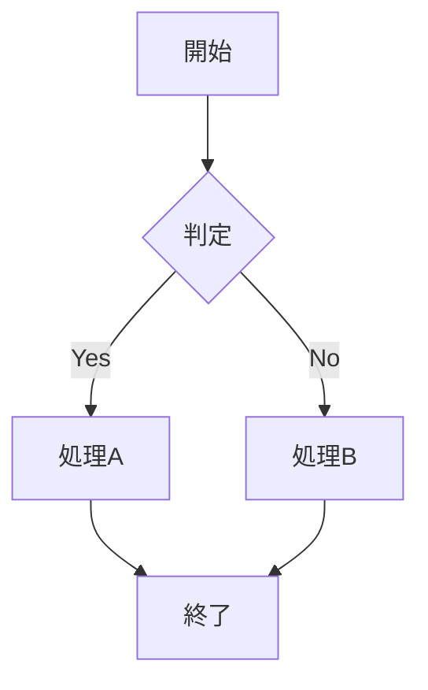

### 10.2 シーケンス図

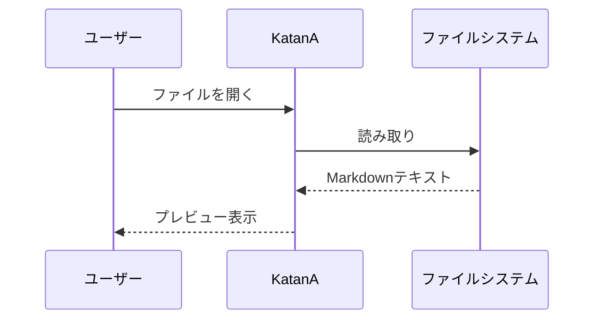

### 10.3 クラス図

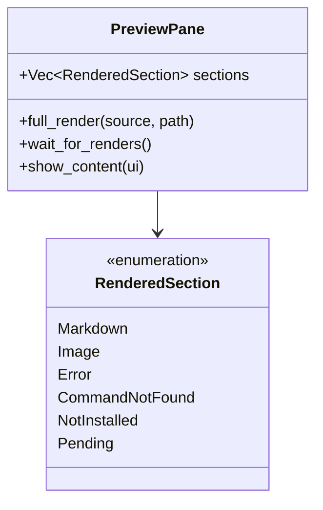

### 10.4 状態遷移図

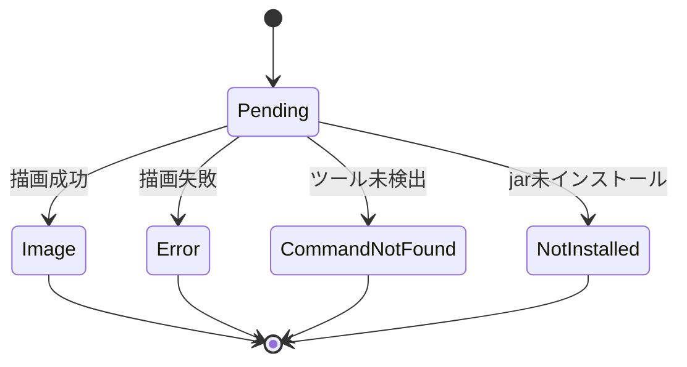

### 10.5 ガントチャート

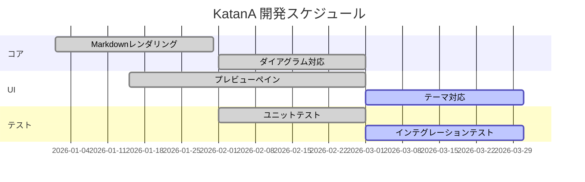

---

## 11. ダイアグラム — PlantUML

### 11.1 シーケンス図

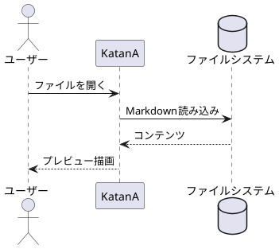

### 11.2 クラス図

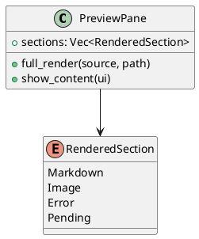

### 11.3 アクティビティ図

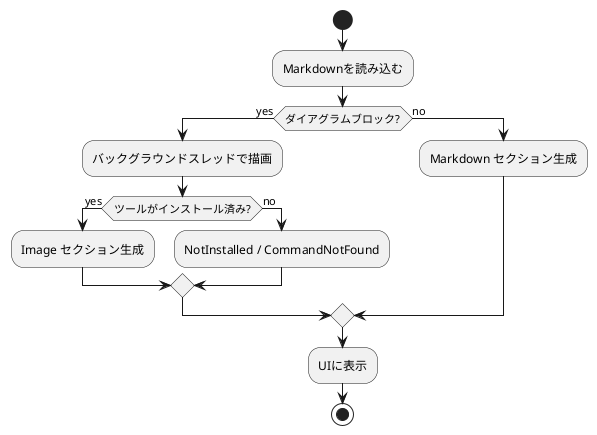

---

## 12. ダイアグラム — DrawIo

### 12.1 基本図形

```drawio
<mxGraphModel>
  <root>
    <mxCell id="0"/>
    <mxCell id="1" parent="0"/>
    <mxCell id="2" value="Hello" style="rounded=1;fillColor=#dae8fc;strokeColor=#6c8ebf;" vertex="1" parent="1">
      <mxGeometry x="50" y="50" width="120" height="60" as="geometry"/>
    </mxCell>
    <mxCell id="3" value="World" style="ellipse;fillColor=#d5e8d4;strokeColor=#82b366;" vertex="1" parent="1">
      <mxGeometry x="250" y="50" width="120" height="60" as="geometry"/>
    </mxCell>
    <mxCell id="4" style="edgeStyle=orthogonalEdgeStyle;" edge="1" source="2" target="3" parent="1">
      <mxGeometry relative="1" as="geometry"/>
    </mxCell>
  </root>
</mxGraphModel>
```

### 12.2 複数の図形と接続

```drawio
<mxGraphModel>
  <root>
    <mxCell id="0"/>
    <mxCell id="1" parent="0"/>
    <mxCell id="2" value="入力" style="shape=parallelogram;fillColor=#fff2cc;strokeColor=#d6b656;" vertex="1" parent="1">
      <mxGeometry x="50" y="30" width="120" height="50" as="geometry"/>
    </mxCell>
    <mxCell id="3" value="処理" style="rounded=1;fillColor=#dae8fc;strokeColor=#6c8ebf;" vertex="1" parent="1">
      <mxGeometry x="50" y="120" width="120" height="50" as="geometry"/>
    </mxCell>
    <mxCell id="4" value="出力" style="shape=parallelogram;fillColor=#d5e8d4;strokeColor=#82b366;" vertex="1" parent="1">
      <mxGeometry x="50" y="210" width="120" height="50" as="geometry"/>
    </mxCell>
    <mxCell id="5" edge="1" source="2" target="3" parent="1">
      <mxGeometry relative="1" as="geometry"/>
    </mxCell>
    <mxCell id="6" edge="1" source="3" target="4" parent="1">
      <mxGeometry relative="1" as="geometry"/>
    </mxCell>
  </root>
</mxGraphModel>
```

---

## 13. 混在コンテンツ（過去不具合: セクション境界の崩れ）

Markdown テキスト、ダイアグラム、コードブロック、テーブルが混在するドキュメントです。
各セクション間にレイアウト崩れがないことを確認してください。

### アーキテクチャ概要

KatanA の描画パイプライン:

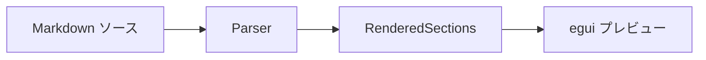

上のフローチャートとこのテキストの間にスペースがあること。

| コンポーネント | 役割 |
| --- | --- |
| `PreviewPane` | セクション管理 |
| `show_content` | UI描画 |

上のテーブルと下のコードブロックの間にスペースがあること。

```rust
enum RenderedSection {
    Markdown(String),
    Image { svg_data: RasterizedSvg, alt: String },
    Error { kind: String, message: String },
    CommandNotFound { tool_name: String },
    NotInstalled { kind: String },
    Pending { kind: String },
}
```

そして下に DrawIo:

```drawio
<mxGraphModel>
  <root>
    <mxCell id="0"/>
    <mxCell id="1" parent="0"/>
    <mxCell id="2" value="混在コンテンツテスト" style="rounded=1;fillColor=#f8cecc;strokeColor=#b85450;" vertex="1" parent="1">
      <mxGeometry x="50" y="30" width="200" height="60" as="geometry"/>
    </mxCell>
  </root>
</mxGraphModel>
```

↑ すべてのセクションが正しく描画され、互いに重ならないこと。

---

## 14. エッジケース

### 14.1 空のコードブロック

```empty
```

### 14.2 非常に長い行

`このテキストは非常に長い行で、水平スクロールやワードラップが正しく動作するかを確認するためのものです。ABCDEFGHIJKLMNOPQRSTUVWXYZabcdefghijklmnopqrstuvwxyz0123456789 を何度も繰り返します。ABCDEFGHIJKLMNOPQRSTUVWXYZabcdefghijklmnopqrstuvwxyz0123456789`

### 14.3 特殊文字

- HTML エンティティ: &amp; &lt; &gt; &quot;
- 日本語: こんにちは世界 🌍
- 絵文字: 🦀 ⚡ 📝 🔧 ✅ ❌ ⚠️ 💡⭐️
- 数学記号: α β γ δ ∑ ∫ √ ∞

### 14.4 脚注

これは脚注付きのテキストです[^1]。もう一つの脚注[^2]もあります。

[^1]: 最初の脚注の内容。
[^2]: 二番目の脚注の内容。

### 14.5 連続する異なるブロック要素

> 引用ブロック

```rust
let code = "引用ブロックの直後";
```

- リスト項目（コードブロックの直後）

| ヘッダー |
| --- |
| リストの直後のテーブル |

↑ 各ブロック要素の間に適切なスペースがあること。

---

## 15. 複数ダイアグラム連続表示

3種類のダイアグラムを連続で配置。1つの失敗が他に影響しないこと。

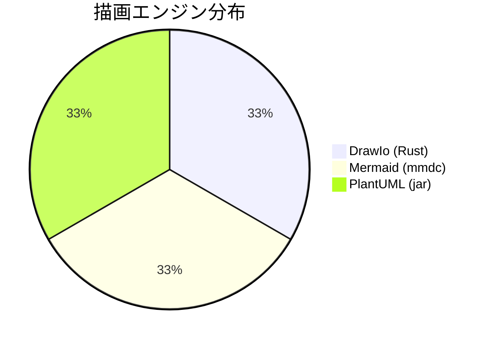

```drawio
<mxGraphModel>
  <root>
    <mxCell id="0"/>
    <mxCell id="1" parent="0"/>
    <mxCell id="2" value="ダイアグラム間" style="rounded=1;" vertex="1" parent="1">
      <mxGeometry x="50" y="30" width="150" height="50" as="geometry"/>
    </mxCell>
  </root>
</mxGraphModel>
```

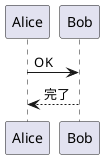

↑ 3つのダイアグラムがそれぞれ独立して描画され、
テキストなしでも正しくスペーシングされること。

---

## ✅ 検証完了

すべてのセクションが正しく表示されていれば、描画系のリグレッションはありません。
